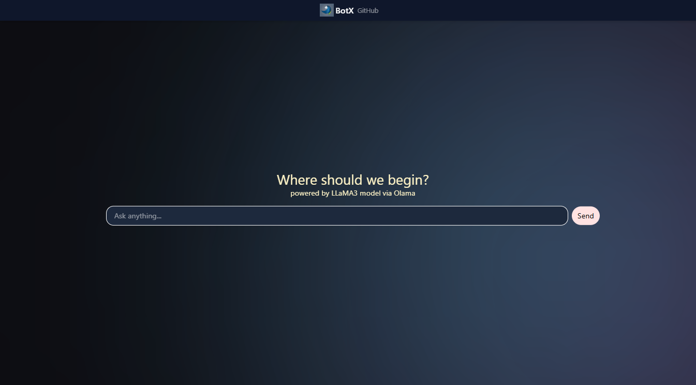
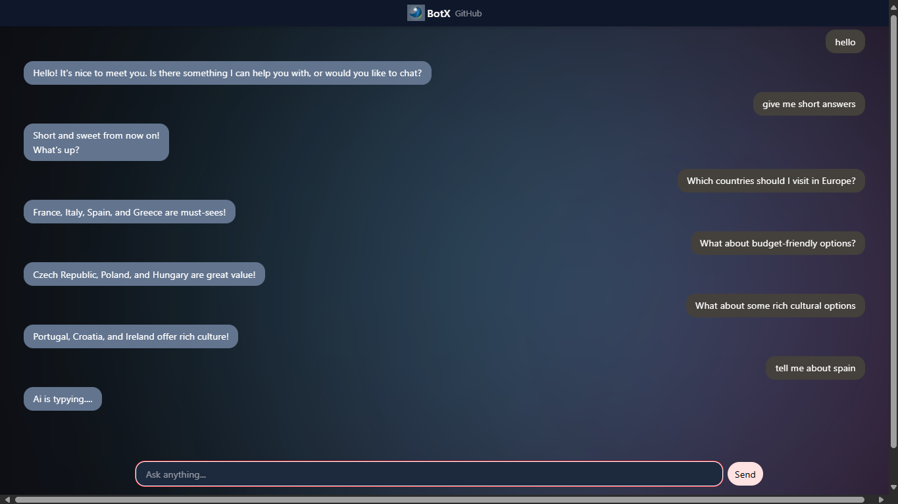

# ChatBot

A web-based AI chatbot using React and Express, powered by a local LLaMA3 model via Olama for context-aware conversations.

## Table of Contents

- [UI](#UI)
- [Features](#features)
- [Tech Stack](#tech-stack)
- [How It Works](#how-it-works)
- [About Backend (Endpoints)](#about-backend-endpoints)
- [Installation](#installation)
- [Usage](#usage)
- [Project Structure](#project-structure)
- [Key Files Description](#Key-Files-Description)

## UI
### Interface Demo



### Contextual Conversation Demo



## Features

-  **Smooth glowing background** - Animated background effects
-  **Responsive design** - Adapts to different screen sizes
-  **Interactive chat interface** - Real-time messaging experience
-  **Dynamic input positioning** - Input box transitions from center to bottom
-  **Fast and lightweight** - Optimized for performance(the token limits are ≈ 120-130 tokens as of for now) NB:Tokens ≠ Words

## Tech Stack

### Frontend
- **React** - JavaScript library
- **Tailwind CSS** - Utility-first CSS framework
- **Vite** -  Dev server & bundler

### Backend
- **Node.js** – JS runtime
- **Express** – Web framework
- **dotenv** – Env variables
- **cors** – Cross-origin requests


### Development Tools
- **Axios** - Promise-based HTTP client
- **npm** - Package manager
- **ESLint** - Code linting
- **Git** - Version control
- **nodemon** - Testing server
- **Prettier** - Code formatter

## How It Works

The application follows a component-based architecture:

```text
📦 Component Architecture
├── MessagesProvider.jsx (Root Provider)
│   ├── Manages global state for messages
│   ├── Provides context to all child components
│   └── Handles message operations (send, receive, delete)
│
├── Child Components
│   ├── ChatInterface - Main chat display
│   ├── MessageInput - User input component
│   ├── MessageList - Display messages
│   └── Background - Animated background effects
```

**Key Features:**
- The `src/components/MessagesProvider.jsx` serves as the central provider component
- All other components are children of MessagesProvider and have access to the message context
- State management is handled through React Context API
```text
- Messages flow from React input →  Express  →  Llama generates reply  →  Express  →  React updates chat.
```

## About Backend (Endpoints)

### API Endpoints

**Endpoints:**

```bash
# Message Operations
POST /api/chat          # Send a new message through

# Chat Operations
post  /api/generate     # Get direct bot raw response
```

**Request Format:**
```json
{
    "model": "llama3",
    "prompt": "What is the color of grass in one word",
    "stream" : false

}
```
**Response Format:**
```json
{
    "model": "llama3",
    "created_at": "2025-10-26T22:24:57.3668657Z",
    "response": "Green.",
    "done": true,
    "done_reason": "stop",
    "context": [
        128006,
        271......,
}
```

## Installation

### Prerequisites
- Node.js (v16 or higher)
- npm or yarn package manager
- Git

### Setup Instructions

1. **Clone the repository:**
   ```bash
   git clone https://github.com/Amitrajit007/botx
   cd Chat-bot #if needed
   ```

2. **Install dependencies:**
   ```bash
   npm install
   ```

3. **Start the development server:**
   ```bash
   npm run dev
   ```

4. **Build for production:**
   ```bash
   npm start
   ```

## Usage

### Getting Started
1. Open your browser and navigate to `http://localhost:5173` (or the port shown in terminal)
2. Start typing your message in the input field
3. Press Enter or click Send to submit your message
4. View the conversation in the chat interface

### Key Features Usage
- **Sending Messages:** Type in the input field and press Enter
- **Viewing History:** Scroll through the message list to see previous conversations

## Project Structure
```
chatbot/                                          # Root folder
│
├── client/                                       # Frontend React app
│     ├── node_modules/                           # Installed npm packages
│     ├── src/                                    # Source files
│     │     ├── assets/                           # Static assets like images
│     │     │ └── logo.webp
│     │     ├── components/                       # React components
│     │     │      ├── App.jsx                    # Main App component
│     │     │      ├── Background.jsx             # Background component
│     │     │      ├── Chat.jsx                   # Chat UI component
│     │     │      ├── Footer.jsx                 # Footer component
│     │     │      ├── Header.jsx                 # Header component
│     │     │      ├── Input.jsx                  # Input box component
│     │     │      ├── MessagesContext.jsx        # Messages-related centext
│     │     │      ├── MessagesProvider.jsx       # Context provider for messages
│     │     │      ├── RenderChat.jsx             # Render chat UI
│     │     │      └── Reply.jsx                  # Reply component
│     │     ├── index.css                         # Global CSS
│     │     └── main.jsx                          # Entry point for React
│     │
│     ├── .eslint/                                # ESLint configuration folder
│     ├── config.js                               # Config file for client
│     ├── index.html                              # Main HTML file
│     ├── package.json                            # npm dependencies & scripts
│     ├── package-lock.json                       # npm lock file
│     ├── update.md                               # Update/change log
│     └── vidconfig.js                            # Video configuration
│
├── server/                                       # Backend Node.js server
│     ├── node_modules/                           # Installed npm packages
│     ├── .env                                    # Environment variables
│     ├── index.js                                # Entry point for server
│     ├── package.json                            # npm dependencies & scripts
│     └── package-lock.json                       # npm lock file
│
├── .gitignore
└── README.md                                     # Project documentation
```
### Key Files Description

| File/Folder | Description |
|-------------|-------------|
| `.gitignore` | Specifies intentionally untracked files to ignore |
| `README.md` | Project documentation and overview |
| `client/` | Frontend code of the chatbot |
| `client/update.md` | Notes or updates related to the frontend |
| `client/src/` | Source folder containing frontend components and assets |
| `client/src/main.jsx` | Frontend entry point for React app |
| `client/src/assets/` | Folder containing static assets |
| `client/src/assets/logo.webp` | Logo image file |
| `client/src/components/` | Folder containing React components |
| `client/src/components/App.jsx` | Main App component |
| `client/src/components/Background.jsx` | Animated glowing background effects |
| `client/src/components/Chat.jsx` | Chat interface UI component |
| `client/src/components/Input.jsx` | Handles user input and sending messages |
| `client/src/components/Messages/` | Folder containing individual message components |
| `client/src/components/Context.jsx` | Provides React context for app-wide state |
| `client/src/components/MessagesProvider.jsx` | Central state management for messages and chat functionality |
| `client/src/components/RenderServer.jsx` | Handles server message rendering |
| `client/src/components/RenderChat.jsx` | Handles chat message rendering |
| `server/` | Backend code of the chatbot |
| `server/index.jsx` | Entry point for server |
| `server/env.env` | Environment variables for backend |
